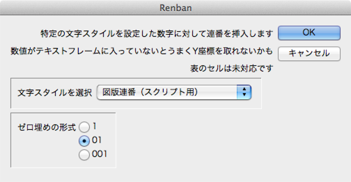

InddRenban
==========

Renbun(Auto Numbering) for InDesign CS4+

#About
特定の文字スタイルを設定した数値に連番を振ります。

#Install
InDesign CS4以降のScripts PanelフォルダにLWRenban.jsxを保存します。

［ウィンドウ］→［自動化］→［スクリプト］を選択して実行します。

#How to Use
- まず連番用の「文字スタイル」を作成します。書式は何も設定しなくてもOKです。
- 適当な数値（00など）に文字スタイルを適用し、それを連番を挿入したい場所に配置していきます。
　その文字が挿入されたテキストフレームのY座標で順番を決めているので、
　小さなテキストフレームなどに入れてからインラインで挿入しておかないと位置がうまく取れないかもしれません。
- スクリプトを実行するとダイアログボックスが表示されるので、連番用の文字スタイルを選択して
　ゼロパディングの形式を選択し、〈OK〉ボタンをクリックします。